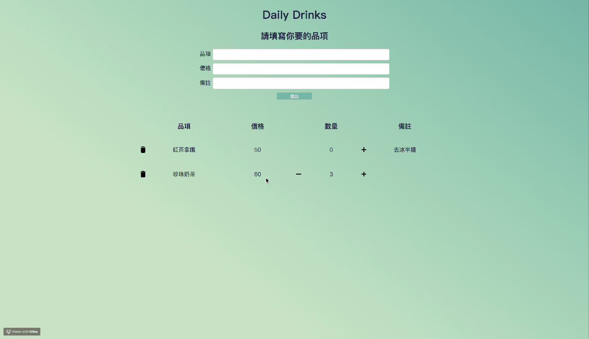

# Daily Drinks

Daily Drinks is an app for filling out a handmade drink form

## Feature

- `add` and `delete` drink order
- `edit` drink order
- `increase` and `decrease` drink order counts

## How to use

- fill the form if you want to add new drink order
- click the delete icon to delete drink order
- click the edit icon to edit drink order
- click the decrease icon and increase icon to control drink order counts

## Description

The app is mainly built by react (v16 hooks), react-redux, and pure CSS. Just like a simple todo-list.

## Testing

By far, only unit tests for utils.

## Todo

- Implement more error handling, i.e. handle price is required a number, not other types, handle empty input is invaild.

- UI beautify, I would use material-UI and JSS to make the app more beautifully. And add some advanced CSS animation.

- Implement E2E testing.
